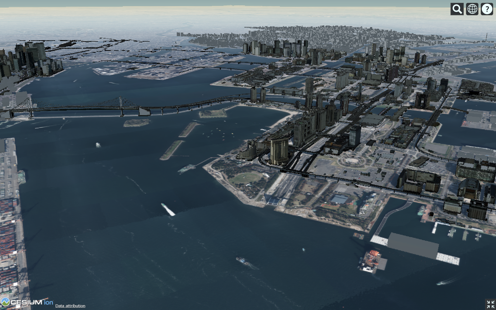

# :rainbow:虹ヶ咲バーチャル聖地巡礼マップ

テレビアニメ「[ラブライブ！虹ヶ咲学園スクールアイドル同好会](https://www.lovelive-anime.jp/nijigasaki/animeradio.php)」の舞台である東京・臨海副都心地区の  
3D都市モデルおよびアニメ中に登場した場所を表示するWebアプリケーションです。

## :warning:注意事項:warning:
**- あくまで個人が趣味で開発したものです。ラブライブ!公式などへのお問い合わせはご遠慮ください。**  
- 本Webアプリケーションを利用したことによって生じたいかなる損害についても、責任を負いかねます。

## Webアプリケーション
以下のリンクより開くことができます。  
- [Webアプリ（PCでの表示を推奨）](https://raokiey.github.io/nijigasaki-virtual-location-map/index.html "虹ヶ咲バーチャル聖地巡礼マップ")
- [Webアプリ（軽量版）](https://raokiey.github.io/nijigasaki-virtual-location-map/lite_version.html "虹ヶ咲バーチャル聖地巡礼マップ 軽量版")

## 使用したデータ
本Webアプリケーションにおいて、以下のデータを使用しております。  
- [PLATEAU配信サービス（試験運用）](https://github.com/Project-PLATEAU/plateau-streaming-tutorial "PLATEAU配信サービス（試験運用）")   
    + PLATEAU-Terrain
    + PLATEAU-Ortho
    + PLATEAU-3DTiles
